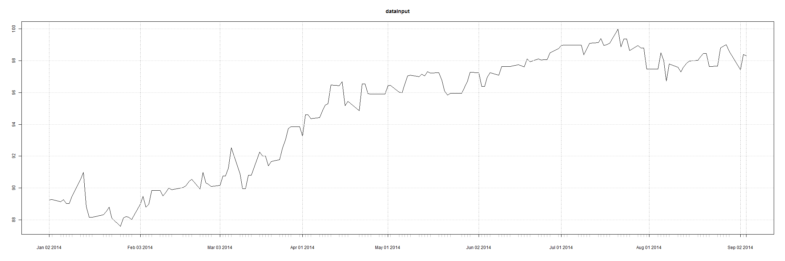

## 3. Detailed Reports Page
Detailed Reports page allow users to view the details of diamonds based on different cut types. 
Users can select the variables they want to include in the table.  
Users can sort table by different variables and search record based on their preferences.  
Users can also determine how many records they want to show on one page.  
Following is a screenshoot of detailed reports page  
  

---

## 4. Download Datasets Page
Download Datasets page allow users to download the entire datasets of diamond products information.Users can select a specific type of  diamonds that they are interested. And the required table will be displayed on the right side of the page.  
After that, users need to click the download button as the picture below.  

  

---

## 5. Exchange Rate Page
Sometimes there will be international trade for diamonds business. So a real-time exchange rate function seems to be necessary in this application.   
In the last page, users can obtain the latest exchange rate regarding the selected currency from the chart above.   
Users are required to select a currency type first, then information will be collected from yahoo finance and be reflected to the line chart below.  
 
