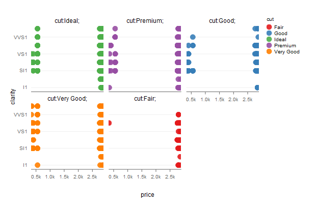
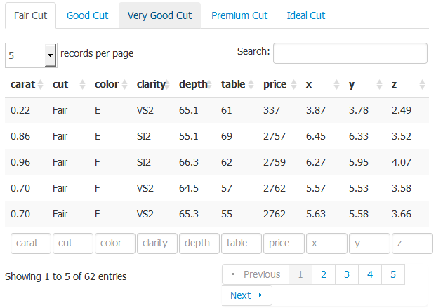
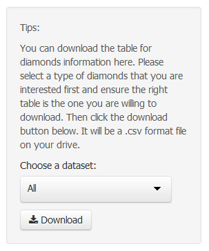

This is a documentation to give a breif description about Product Report shiny application.
To begin with, there are four main functions/pages in this application, which are 'summary', 'detailed report', 'download datasets' and 'exchange rate'. Users can access to above four pages via the bar on the top of each page as following: 

 

In details, a user can do following things in each page:

---

### 1. SUMMARY
  
This page is a summary of all diamond product information. Users are able to visualize data from different aspects or attributes of products.  

Product details have been visualized by a point plot and you are able to customize your own summary chart by selecting different variables you want to explore on x or y axis. You can also choose the categories of diamonds to reflect them on the diagram. Please make the adjustments towards the chart above. 

---

### 2. DETAILED REPORT
 
This page allow users to view the details of diamonds based on different cut types. You can select the variables you want to include in the table. You can sort table by different variables and search record based on your preferences. You can also determine how many records you want to show on one page. 

---

### 3. DOWNLOAD DATASETS
 
This page allow users to download the entire datasets of diamond products information. Users can select a type of specific diamonds that they are interested. And the required table will be displayed at the right part of page. After that, users should click the download button in the picture above. The downloaded datasets will be a .csv format file on users' drive.

---

### 4. EXCHANGE RATE
 
Sometimes there will be international trade for diamonds business. So a real-time exchange rate function seems to be necessary in this application. In the last page, users can obtain the latest exchange rate regarding the selected currency from the chart above. Users are required to select a currency type first, then information will be collected from yahoo finance and be reflected to the line chart above.

---
